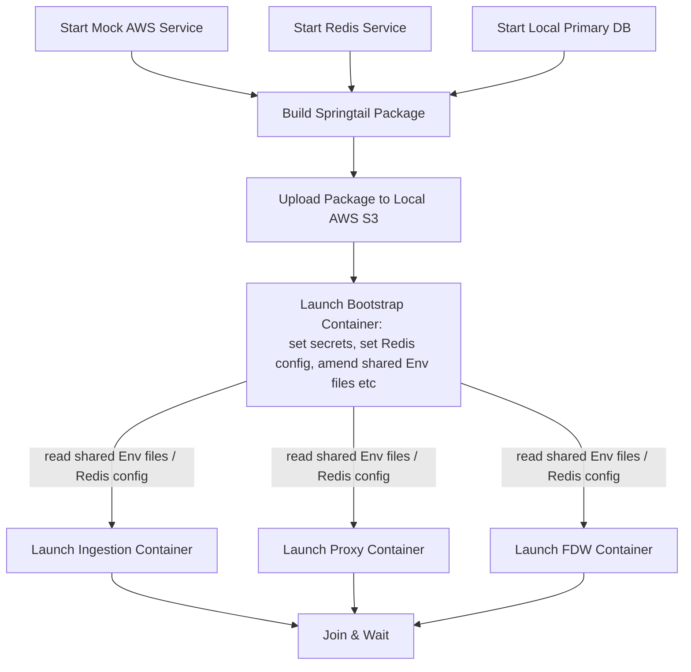

Local Cluster
====

This directory contains configuration files and scripts to set up a local cluster using docker compose.
This setup is only for development and testing purposes.

## Prerequisites

- Docker
- Docker Compose
- Python3
- AWS CLI
- You must have the AWS SSO configured

## Cluster Building Flow



> <strong> &#x1f514; Notice</strong><br>
> In [README.md](README.md)order to simulate the deployed environment, we will build and package the springtail service. 
> This is done in a "builder container" whose image is stored in AWS ECR. 
> So you need AWS SSO configured to access it.

## Basic Usage

1. First build a springtail package. You can reuse an existing package if you have one though.

   ```shell
   $ ./cluster build-package <out-dir>
   ```

2. Start the local cluster. You can specify the full package path.

   ```shell
   $ ./cluster up <full-package-path>
   ```

3. It takes a few minutes (usually less than 2) to start the cluster. You can check the status by:

   ```shell
   $ ./cluster status
   ```

4. Once all containers are up and running, you can `shell` into any container. For example:

   ```shell
   $ ./cluster sh <name>
   ```

The container names are:

- `proxy`
- `ingestion`
- `fdw`
- `controller`

5. By default, the `springtail-coordinator` service is not started. You can start it by (inside a container):
   ```shell
   $ systemctl start springtail-coordinator
   ```

## Internals

This section explains what happens under the hood when you run the above commands.

### Build Package

The `./cluster build-package <out-dir>` command does the following:
Start a temporary build container from the image identified by `BASE_BUILDER_IMAGE_TAG` in the `cluster` script, which
resides in the DevSupport ECR repo.
If the BASE_BUILDER_IMAGE_TAG is not available locally it will try to pull from the remote repo, thus requiring AWS SSO
configured.
It saves the package into the `<out-dir>` directory on the host machine.
The package is a tarball file named `springtail-<date-version>-<system-settings-gitsha>.tar.gz`.

### Start Cluster

The `./cluster up <full-package-path>` command does the following:
It sets the <full-package-path> to the `PACKAGE_FILE_NAME` environment variable, making it available to the build
process of all the containers.
Then it starts the supporting local services, like the AWS mock, Redis, and a local PostgreSQL database serving as
primary DB. Then it uploads the package to the local mock S3 service.
Then it launches a bootstrap container that sets up shared environment files, secrets, and Redis configuration.
Specifically, the bootstrap process will add new env vars into `./env/.env` file.
Finally, it launches the main service containers: `proxy`, `ingestion`, and `fdw`, picking up all the env files in the
`./env` directory.

### Service Initializations

#### local-cluster-bootstrap

This runs *before* any service container is started. It does the following:

1. Set up shared environment files in the `./env` directory, which will be picked up by all service containers;
2. Set up Redis configuration, creating a default user and password, and saving the config to `./env/redis.env`;
3. Set up secrets, creating a self-signed certificate for HTTPS, and saving the secrets to `./env/secrets.env`;

In summary, this is setting up the supporting environment for the service containers to run.

#### "CloudInit" Script

For each service container, upon startup, it runs a `init-services` script, managed by supervisord, that does the
following:

1. Download S3 package and extract it, moving the coordinator to the `/opt/springtail` directory as the bootstrap
   coordinator;
2. Make sure all necessary directories exist, creating them if needed;
3. For `fdw` specifically, it triggers an Ansible script to customize the PostgreSQL;
   This is akin to the EC2's `userdata` script (CloudInit), which is used to initialize a container.


