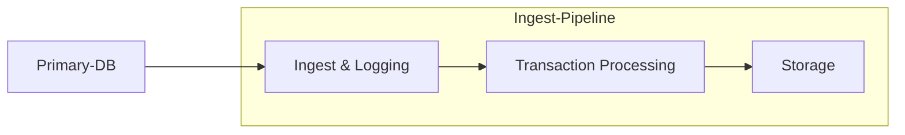
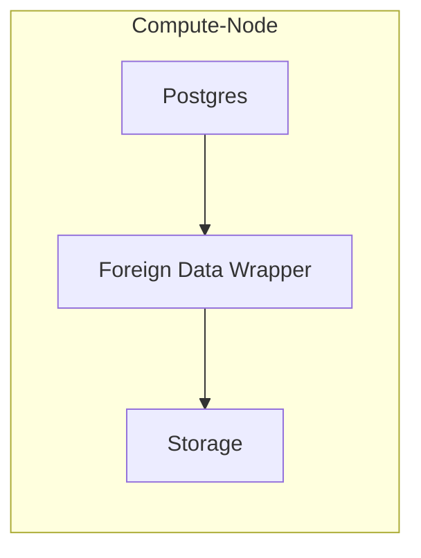
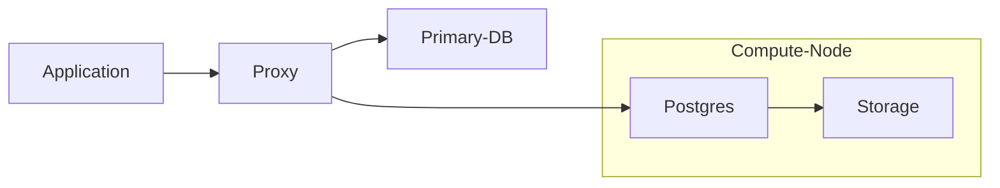

## Overview

Springtail is a distributed, read-only database designed to scale out compute resources for servicing read-intensive workloads. Using a shared-storage layer, Springtail enables rapid scaling of stateless compute resources, allowing them to start up or shut down instantly. It ingests data from a Postgres primary database instance and stores that data in a proprietary table format. It uses a modified Postgres frontend to service database queries ensuring Postgres query compatibility.

## Components

Springtail’s architecture includes several core components, each running independently, with the capability to recover independently. Each component stores data persistently in the shared filesystem and communicates with other components via Remote Procedure Calls (RPCs).

### Storage layer

The storage layer is a distributed filesystem accessible by all components. This fault-tolerant filesystem stores data in multiple availability zones and can scale by adding additional storage nodes. Table data and metadata are stored as files within the filesystem. Data is written copy-on-write, enabling access to older versions of tables.

### Ingest pipeline

Springtail ingests data from a primary Postgres database using the Postgres logical replication protocol. DDL changes such as table creation and table modification are not replicated by Postgres (using logical replication). Triggers are installed on the primary database to add DDL modifications to the replication stream (for `CREATE TABLE` | `ALTER TABLE` | etc). Once data is received by Springtail it is logged to the storage system making it durable, so that the primary database can release its resources (freeing data from its write-ahead log).

Once the data is durable, transactions are extracted from the replication stream. Each transaction is isolated from the log and the operations that make up that transaction (e.g., `INSERT` | `UPDATE` | `DELETE` | etc.) are processed, updating the corresponding tables within the storage layer. Data within each table is stored in primary key order. When all operations for a transaction are processed, the system's latest transaction ID is advanced, resulting in a new version of the database.

### Compute query node

Data is queried via a Postgres frontend running on a compute node. Each compute node accesses the storage-layer in a read-only fashion to read table data and metadata. Multiple compute nodes can be run in parallel. Thanks to their stateless design, compute nodes can be rapidly scaled up or down.

Springtail uses PostgreSQL’s **Foreign Data Wrapper (FDW)** interface to enable Postgres to access the table data stored within the shared filesystem, ensuring seamless compatibility with Postgres queries, as if querying a native Postgres instance.

### Proxy

One of Springtail’s core tenants is providing access to scale-out replication without requiring application changes or database migration. As such, Springtail introduces a proxy that acts as an intermediary between the customer application and the Springtail Foreign Data Wrapper frontend nodes. Applications connect to the Springtail proxy as they would to the primary Postgres database. The proxy then routes traffic appropriately—sending writes to the primary database and reads to Springtail’s compute nodes.

The proxy parses the Postgres wire protocol and understands which queries the Springtail system can handle, and which need to be sent to the primary database. Additionally, the Springtail proxy provides load-balancing across the read-replicas and provides session-level connection pooling.

