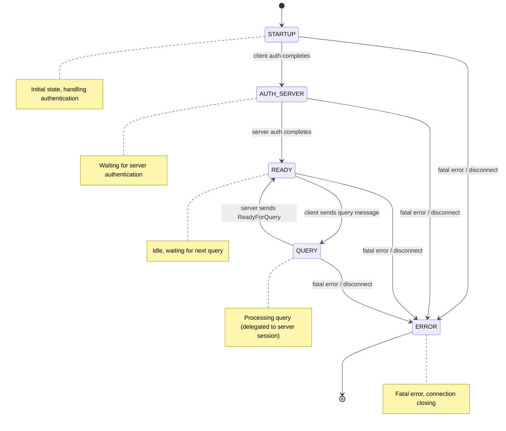

# Client Session Architecture

## Overview

The Client Session represents a connection from a PostgreSQL client (e.g., psql, application) to the Springtail proxy. It manages the client's state, handles incoming queries, coordinates with server sessions, and ensures proper query routing and response handling.

## Hierarchy

The Client Session builds upon a base Session class which provides:
- Basic connection management (socket, read/write buffers)
- Message parsing and framing
- Asynchronous I/O handling
- Connection state tracking

## Key Responsibilities

1. **Query Reception**: Receive and parse PostgreSQL protocol messages from client
2. **Query Routing**: Determine which server session should execute the query
3. **State Management**: Track transaction state, prepared statements, portals, cursors
4. **Response Coordination**: Collect responses from server sessions and forward to client
5. **Session Replay**: Ensure new server sessions have correct session state
6. **Error Handling**: Manage error conditions and recovery

## State Machine

### Primary States



### State Transitions

#### STARTUP → AUTH_SERVER
- **Trigger**: Client authentication completes successfully
- **Actions**:
  - Extract database and user credentials
  - Create primary server session
  - Initiate server authentication

#### AUTH_SERVER → READY
- **Trigger**: Server authentication completes successfully
- **Actions**:
  - Send authentication success to client
  - Set transaction status to idle
  - Prepare for query processing

#### READY → QUERY (via Server Session)
- **Trigger**: Client sends query message (Query, Parse, Bind, Execute, etc.)
- **Actions**:
  - Validate query message
  - Determine target server session (primary vs replica)
  - Queue message for server session
  - Server session transitions to QUERY or DEPENDENCIES state

#### Server Session QUERY → READY
- **Trigger**: Server sends ReadyForQuery
- **Actions**:
  - Update transaction status (idle, in-transaction, error)
  - Client session remains in READY state
  - Process next queued message if available

#### ANY → ERROR
- **Trigger**: Fatal error, client disconnect, or Terminate message
- **Actions**:
  - Close connection
  - Clean up resources
  - Notify server sessions to shut down

## Query Processing Flow

### 1. Query Reception

The client session receives PostgreSQL protocol messages from the client:

**Message Types Handled:**
- **Query (Simple Protocol)**: Multiple semicolon-separated SQL statements
- **Parse**: Prepare a named or unnamed statement
- **Bind**: Bind parameters to a prepared statement creating a portal
- **Execute**: Execute a bound portal
- **Describe**: Request description of a statement or portal
- **Close**: Close a statement or portal
- **Sync**: Synchronization point in extended protocol
- **Flush**: Force pending responses to be sent

### 2. Query Analysis

For each incoming query, the client session:

1. **Parse Query Text**: Extract SQL statements from message
2. **Classify Statements**: Determine query types (SELECT, INSERT, UPDATE, etc.)
3. **Analyze Dependencies**: Identify state-changing operations:
   - SET statements (session variables)
   - PREPARE statements (prepared statements)
   - DECLARE statements (cursors)
   - Transaction control (BEGIN, COMMIT, ROLLBACK, SAVEPOINT)
4. **Determine Read Safety**: Check if query modifies data or accesses replicated tables
5. **Determine Routing**:
   - Read-only queries → replica (if available and not in transaction)
   - Write queries → primary
   - Queries in transaction → same server as transaction

### 3. Server Session Selection

The routing logic follows these rules:

**In Transaction:**
- All queries route to the server that started the transaction
- Typically this is the primary server
- Ensures transaction isolation and consistency

**Outside Transaction:**
- **Write Queries**: Always route to primary
- **Read-Only Queries**:
  - Route to replica if available and database is ready
  - Fall back to primary if no replica available
  - Fall back to primary if in primary-only mode

**Shadow Mode:**
- Read-only queries sent to both primary and replica
- Primary results returned to client
- Replica results discarded (for testing/validation)

### 4. Session Replay (State Synchronization)

When sending a query to a server session that hasn't processed queries from this client before, or when switching servers, the client session ensures the server has the correct session state through a process called "session replay."

**Session State Includes:**
- Session variables (SET statements like `work_mem`, `application_name`)
- Prepared statements (PREPARE statements)
- Cursors with hold (DECLARE WITH HOLD statements)

**Replay Process:**

```
Client Session State:
  - work_mem = '64MB'
  - application_name = 'myapp'
  - Prepared statement 'stmt1'

First Query to New Server:
  ↓
1. Client session queries statement cache for replay history
2. Generates dependency messages containing:
   - SET work_mem = '64MB'
   - SET application_name = 'myapp'
   - PREPARE stmt1 AS ...
3. Server session receives dependencies first
4. Server session executes dependencies (server enters DEPENDENCIES state)
5. Server session transitions to QUERY state
6. Server session executes actual query
```

**Transaction Replay:**

When switching from replica to primary mid-transaction (rare case):
- Transaction-level statements are also replayed
- Ensures transaction state is consistent on new server

### 5. Response Handling

Server sessions send responses back to the client session via callbacks:

**Response Types:**
- **ParseComplete**: Parse succeeded
- **BindComplete**: Bind succeeded
- **CommandComplete**: Statement executed with result summary
- **RowDescription**: Column metadata for query results
- **DataRow**: Individual result row data
- **ReadyForQuery**: Server ready for next command (includes transaction status)
- **ErrorResponse**: Query failed with error details

The client session forwards these responses directly to the client, maintaining protocol transparency.

## Server Session Callbacks

Server sessions invoke callbacks on the client session to report completion and status:

### Message Response Callback

Called when a message completes execution:

**For Each Message:**
- Server session executes all statements in the message
- Sends completion notification to client session
- Client session updates statement cache
- Records success or failure status

**Statement Cache Updates:**
- Add prepared statements to cache
- Add cursors to cache
- Track transaction state changes
- Remove closed statements/portals

### Ready For Query Callback

Called when the server sends ReadyForQuery:

**Transaction Status Update:**
- Update transaction status (I/T/E)
- Clear associated session if no longer in transaction
- Perform transaction commit/rollback in cache

**State Synchronization:**
- Replay pending state to other server sessions
- Ensure all server sessions have consistent session state
- Only done when outside transactions

## Statement Cache Interaction

The client session maintains a History Cache that tracks query statements and their properties:

### Session History

Long-lived state that persists across transactions:
- **SET statements**: Session variables (e.g., work_mem, search_path)
- **PREPARE statements**: Named prepared statements
- **DECLARE WITH HOLD**: Cursors that survive transaction end
- **LISTEN statements**: Notification channels

### Transaction History

Transaction-scoped state that exists only within a transaction:
- All statements executed in the current transaction
- Rolled back on ROLLBACK or error
- Merged to session history on successful COMMIT
- Organized by savepoint levels

### History Cache Operations

**Adding Statements:**
- Parse each query to determine type and properties
- Track read-safety, dependencies, and side effects
- Associate with current transaction or savepoint level
- Store metadata for replay purposes

**Replay for Server Sessions:**
- Query cache for statements needed by a server session
- Filter by session vs transaction scope
- Filter by read-only vs read-write
- Generate dependency messages in correct order

**Transaction Operations:**
- **Commit**: Merge transaction history to session history
- **Rollback**: Discard entire transaction history
- **Savepoint**: Create nested scope level
- **Rollback to Savepoint**: Discard statements after savepoint

## Thread Safety

The Client Session operates within a single-threaded asynchronous I/O model:

- Each client session runs on a single I/O thread
- No locking required within a client session
- Server session callbacks execute on the same thread
- Message queues use locks for cross-thread notifications
- Failover notifications use mutex-protected queue

## Performance Considerations

### Message Batching
Multiple messages are grouped together to reduce round trips between the proxy and PostgreSQL server. This is especially beneficial for extended protocol sequences (Parse/Bind/Execute/Sync).

### Read Replica Routing
Read-only queries are offloaded to replica servers, reducing load on the primary and improving overall throughput. This works transparently as long as the client is not in a transaction.

### Connection Pooling
Server sessions can be pooled and reused across different client sessions, avoiding the overhead of establishing new connections and re-authenticating.

### Statement Cache Optimization
The statement cache minimizes the overhead of session replay by:
- Only replaying statements not yet seen by a server
- Tracking which servers have which state
- Compacting history on transaction commit
- Removing redundant statements

### Pipelined Execution
Server sessions pipeline messages to PostgreSQL, allowing multiple messages to be sent before waiting for responses. This reduces latency and improves throughput.
