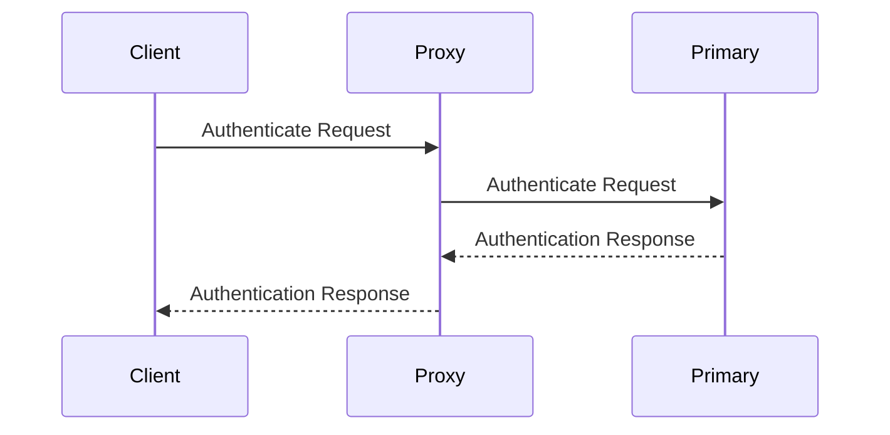

## Enabling logical replication on the primary

Before Springtail can replicate from your primary database, logical replication must be enabled and a few WAL-related parameters configured on the primary.

### Set `wal_level` to `logical`

For a self-hosted PostgreSQL instance, set `wal_level = logical` in `postgresql.conf` and restart the server.

On Amazon RDS or Aurora PostgreSQL, set this via a parameter group instead. In the RDS console, click **Parameter groups**, then **Create parameter group** and create a new parameter group with the same family as the primary database (for Aurora PostgreSQL, select the parameter type **cluster parameter group**). This creates a clone of the default parameter group. Under **Edit** mode, search for the `rds.logical_replication` parameter and set it to `1`. After saving, associate the new parameter group with the primary database, applying the change immediately if possible (a reboot is required).

### Set `max_replication_slots`

Set `max_replication_slots` to a value greater than or equal to the number of databases Springtail will replicate, since Springtail uses one replication slot per database.

### Set `max_slot_wal_keep_size`

Set `max_slot_wal_keep_size` to bound the amount of WAL the primary retains for replication slots. This prevents the primary database from running out of disk space if a replica falls behind. Choose a value appropriate for the primary's available disk.

## Creating the Springtail user

To read the logical replication stream, Springtail requires a user account in your existing primary PostgreSQL instance. We recommend creating a new user specifically for Springtail.

<Tabs>
  <Tab title="Amazon">
    #### Option 1: Superuser access

    Creating a user with `SUPERUSER` privileges allows Springtail to fully manage replication slots, publications, and triggers for the logical replication stream.

    In Amazon RDS, the user must be granted the `rds_superuser` role.

    To create this user, use the following command, replacing `<secret_password>` with your desired password:

    ```sql
    CREATE USER springtail WITH PASSWORD '<secret_password>' LOGIN role rds_superuser
    ```

    Make sure you use a strong password, and keep it handy when configuring your Springtail instance.

    #### Option 2: Read-only user with CREATE permission

    Alternatively, you can create a **read-only user** with restricted access. This user needs:

    - **CONNECT** access to the databases to be replicated.
    - **SELECT** access to tables within those databases for replication purposes.
    - **SELECT** access to the tables in the pg_catalog schema. These are queried to determine schema of the replicated tables and by the proxy when a user authenticates.
    - (Optional) **CREATE** access to the databases to be replicated. Springtail will create a special schema on the databases to be replicated to host triggers and functions. If you do not grant CREATE access, you will need to run the setup scripts delivered by Springtail manually.
    > By default all users have access to the tables within the pg_catalog schema that Springtail requires. However, if you are not using the default permissions, the Springtail user will require access to:
    > pg_class, pg_namespace, pg_attribute, pg_index, pg_collation, pg_type, pg_constraint, pg_database, pg_roles

    - **REPLICATION** role to start replication and query the replication slot (see below for specific role based on your hosted environment).

    In this case, you will need to set up and manage replication slots, publications, and triggers manually. Springtail will provide scripts to perform these tasks, but you’ll be responsible for executing them correctly.

    To create this user, use the following command, replacing `<role>` with your desired user name and `<secret_password>` with your desired password:

    ```sql
    CREATE USER <role> WITH PASSWORD '<secret_password>' ROLE rds_replication;
    ```

    After creating the user, grant `CONNECT` access to each database:

    ```sql
    GRANT CONNECT ON DATABASE <your_database> TO <role>;
    ```

    Finally, connect to each database and grant `SELECT` access to the desired resources:

    ```sql
    # To grant access to a single table
    GRANT SELECT ON <table_name> TO <role>;
    
    # To grant access to all of the existing and future tables in a schema
    GRANT SELECT ON ALL TABLES IN SCHEMA <schema> TO <role>;
    ALTER DEFAULT PRIVILEGES IN SCHEMA <schema> GRANT SELECT ON TABLES TO <role>;
    ```

    Make sure you use a strong password, and keep it handy for [instance setup](/guides/instances).
  </Tab>
  <Tab title="Supabase">
    #### Option 1: Superuser access

    Creating a user with `SUPERUSER` privileges allows Springtail to fully manage replication slots, publications, and triggers for the logical replication stream.

    In Supabase, the user must be granted the `supabase_admin` role.

    To create this user, use the following command, replacing `<secret_password>` with your desired password:

    ```sql
    CREATE USER springtail WITH PASSWORD '<secret_password>' LOGIN role supabase_admin
    ```

    Make sure you use a strong password, and keep it handy when configuring your Springtail instance.

    #### Option 2: Read-only user

    Alternatively, you can create a **read-only user** with restricted access. This user needs:

    - **CONNECT** access to the databases to be replicated.
    - **SELECT** access to tables within those databases for replication purposes.
    - **SELECT** access to the tables in the pg_catalog schema. These are queried to determine schema of the replicated tables and by the proxy when a user authenticates.

    > By default all users have access to the tables within the pg_catalog schema that Springtail requires. However, if you are not using the default permissions, the Springtail user will require access to:
    > pg_class, pg_namespace, pg_attribute, pg_index, pg_collation, pg_type, pg_constraint, pg_database, pg_roles

    - **REPLICATION** role to start replication and query the replication slot (see below for specific role based on your hosted environment).

    In this case, you will need to set up and manage replication slots, publications, and triggers manually. Springtail will provide scripts to perform these tasks, but you’ll be responsible for executing them correctly.

    To create this user, use the following command, replacing `<role>` with your desired user name and `<secret_password>` with your desired password:

    ```sql
    CREATE USER <role> WITH PASSWORD '<secret_password>' ROLE supabase_replication_admin;
    ```

    After creating the user, grant `CONNECT` access to each database:

    ```sql
    GRANT CONNECT ON DATABASE <your_database> TO <role>;
    ```

    Finally, connect to each database and grant `SELECT` access to the desired resources:

    ```sql
    # To grant access to a single table
    GRANT SELECT ON <table_name> TO <role>;
    
    # To grant access to all of the existing and future tables in a schema
    GRANT SELECT ON ALL TABLES IN SCHEMA <schema> TO <role>;
    ALTER DEFAULT PRIVILEGES IN SCHEMA <schema> GRANT SELECT ON TABLES TO <role>;
    ```

    Make sure you use a strong password, and keep it handy for [instance setup](/guides/instances).
  </Tab>
</Tabs>

## Replication slots, publications, triggers and functions

To set up logical replication in each database, Springtail creates one publication, one replication slot, and two triggers that utilize three custom functions.

- A publication in PostgreSQL captures a set of changes (inserts, updates, and deletes) made to a specific table or set of tables in a database that can be sent to subscribers for replication. This is what defines the set of tables being replicated and captures their changes.
- A replication slot in PostgreSQL ensures that the changes made in the primary database are retained until they are consumed by a subscriber. It acts as a buffer that stores the changes for a subscriber until they are applied. This ensures that Springtail does not miss any changes to the data, even in the face of network disconnect, database restart, or other such issues.
- The triggers are created to capture schema changes within the database by emitting custom messages into the replication stream that Springtail can use to keep it’s copy of the schemas up-to-date. It also ensures that tables created without a primary key are marked with `REPLICA IDENTITY FULL` which will ensure that the entire row is sent whenever updates or deletes are performed against the table.

You will need `SUPERUSER` privileges or `CREATE` privileges on the databases to be replicated, in order to create these objects automatically.

After a publication and replication slot are created, Springtail will install triggers and functions on each table that is part of the publication. This will be done inside a special schema named `__pg_springtail_triggers`.

If you created a Springtail user with `SUPERUSER` privileges, Springtail will create these objects automatically when you set up your instance.
Otherwise, you can either create the `__pg_springtail_triggers` schema manually, then grant full access to the Springtail user, or you can run the grant `CREATE` privilege to the Springtail user, and Springtail will create the schema in the first place automatically.


## Authenticating existing users in Springtail

Springtail authenticates users when they log in to the Springtail Proxy.  Springtail's Proxy performs user authentication based on the users that exist in the Primary database and only allows those users that have CONNECT access to query the replicated database.  The Proxy connects to both the Primary database as well as the Springtail replica in order to perform read/write splitting (sending writes to the Primary database, while sending reads to the Springtail replica).

The Proxy caches the set of users and the databases to which they have access, and refreshes this data every few seconds by querying the Primary database.  Currently, no other access checks are performed on users accessing replicated data (i.e., row level permissions and table level access checks are not performed).  The Proxy authentication is 2-phased.  In the first phase, the client or application authenticates with the Proxy (the Proxy is acting as the server); in the second phase, the Proxy authenticates with the Primary / replica (the Proxy is acting as the client).  The Proxy uses the same username/password for both phases of authentication and the password is verified in each phase; if either phase fails, the client is denied access.



When setting up a database instance, Springtail requires a list of users, including their username and password, that will be logging in via the Proxy.  The username and password must match the Primary database's version (i.e., that user must be able to log into the primary using that username and password).  The password can be supplied in one of three forms: plain text, MD5 hash, or SCRAM-SHA-256 hash.  The MD5 and SCRAM hashes can be obtained by querying the `pg_shadow` database tables; unfortunately, this table is not accessible on AWS RDS or Aurora instances.  If using a MD5 or SCRAM hash as the password, the Primary database must be setup to accept that form of authentication for that user.  Using a SCRAM hash is the most secure, as the hash by itself is not sufficient to log into the Primary (it is combined with a client secret that is extracted by the Proxy when the client authenticates to the Proxy).
