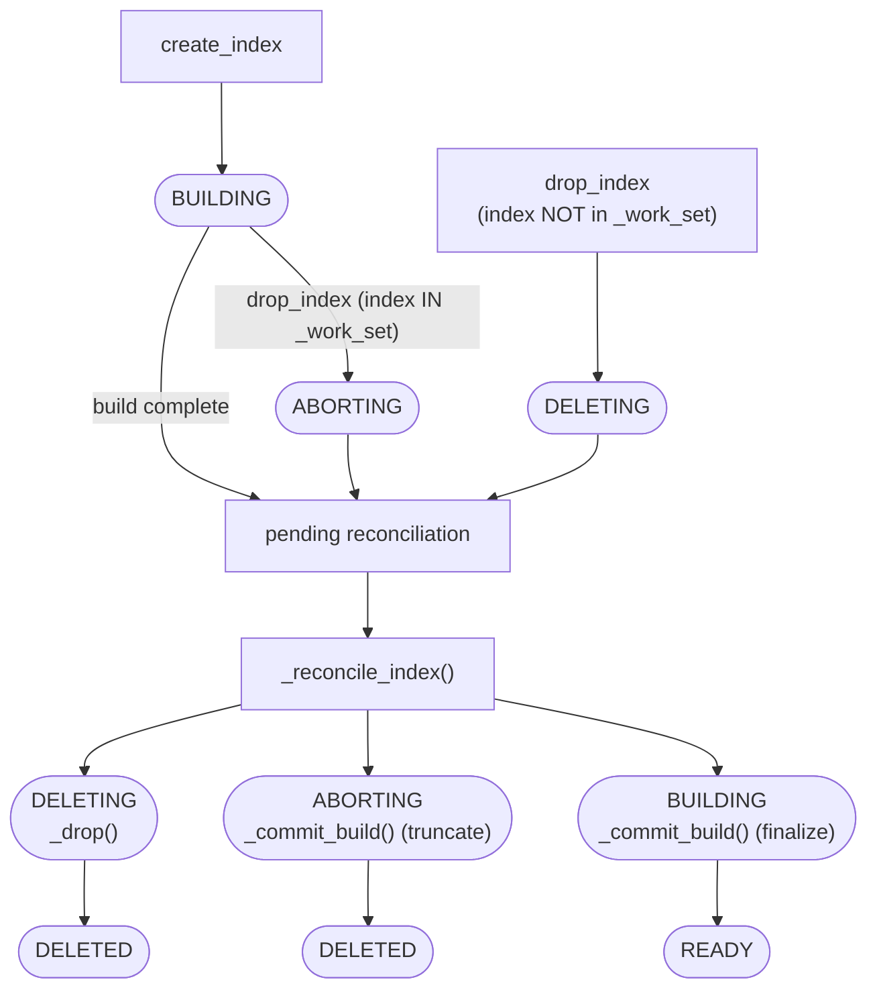
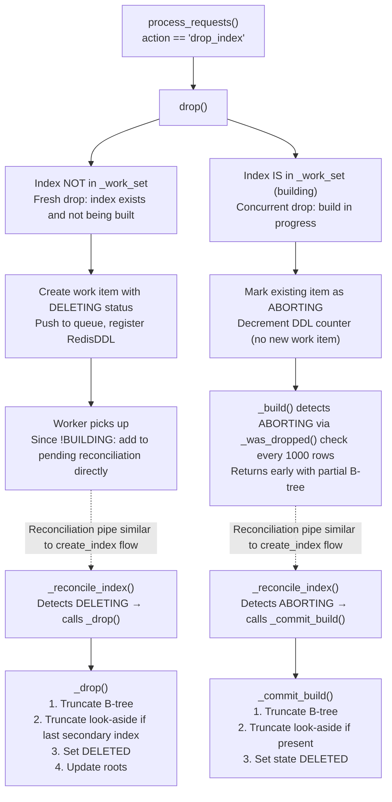
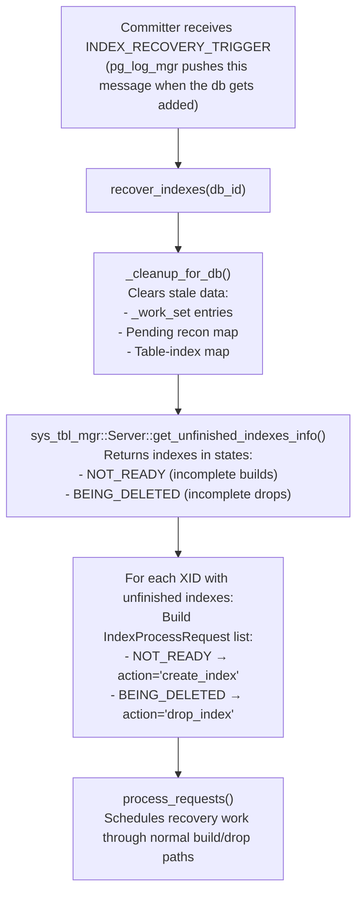
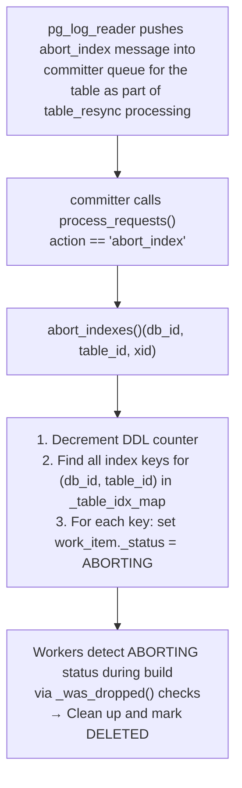

## Overview

The `Indexer` class is the core component responsible for building and managing secondary indexes on tables in the Springtail database system. It operates as a multi-threaded service within the `springtail::committer` namespace, handling index creation, deletion, and abort operations asynchronously via worker threads. Recovery and reconciliation operations are synchronous—the Committer waits for them to complete before proceeding.

### Responsibilities

- **Building secondary indexes** by scanning table data
- **Building look-aside indexes** to reduce write amplification (see [Look-Aside Index](#look-aside-index) for details)
- **Handling index drops** - both immediate drops and drops while a build is in progress
- **Recovering incomplete index operations** after system crashes or shutdowns
- **Reconciling indexes** with data changes that occurred during the build phase
- **Coordinating with committer** to signal when index operations are ready for commit

### Integration with Committer

The Indexer is owned and managed by the `Committer` class:

1. **Initialization**: Committer creates the Indexer in `run()` with a configurable worker count
2. **Request routing**: Committer calls `process_requests()` after batching index requests across XIDs
3. **Recovery trigger**: Committer invokes `recover_indexes()` when it receives an `INDEX_RECOVERY_TRIGGER` message
4. **Reconciliation**: Committer calls `process_index_reconciliation()` when it receives a `RECONCILE_INDEX` message

---

## Key Components

### Index Status States

The lifecycle of an index operation is tracked through three states:

```cpp
enum class IndexStatus {
    BUILDING,   // Default state - index build is in progress
    DELETING,   // Fresh drop request for an index not currently being built
    ABORTING    // Drop requested while build is in progress
};
```

**State Transitions:**


**Notes:**
- `create_index` → `BUILDING`: Default state when an index build is initiated
- `drop_index` on index in `_work_set` → `ABORTING`: Build in progress, mark for abort
- `drop_index` on index NOT in `_work_set` → `DELETING`: Fresh drop, no build in progress
- `_reconcile_index()` checks the current status and decides:
  - `DELETING` → calls `_drop()` → `DELETED`
  - `ABORTING` → calls `_commit_build()` (truncate) → `DELETED`
  - `BUILDING` → calls `_commit_build()` (finalize) → `READY`

### Core Data Structures

#### IndexParams
Encapsulates all parameters needed for an index operation:

```cpp
struct IndexParams {
    uint64_t _db_id;                           // Database identifier
    uint64_t _xid;                             // Transaction ID when index was created
    proto::IndexProcessRequest _index_request;  // Protobuf request containing index metadata + operation request
    IndexStatus _status = IndexStatus::BUILDING; // Current operation status
};
```

#### IndexState
Captures the state of an index after initial build phase, used during reconciliation:

```cpp
struct IndexState {
    MutableBTreePtr _root;            // B-tree root for the secondary index
    Key _key;                         // (db_id, index_id) identifier pair
    IndexParams _idx;                 // Original index parameters
    uint64_t _tid;                    // Table ID this index belongs to
    MutableBTreePtr _look_aside_root; // Look-aside index root (may be nullptr)
};
```

#### Key Type
Unique identifier for work items:
```cpp
using Key = std::pair<uint64_t, uint64_t>;  // (db_id, index_id)
```

### Internal Maps and Queues

| Member | Type | Purpose |
|--------|------|---------|
| `_work_set` | `unordered_map<Key, IndexParams>` | Active index operations keyed by (db_id, index_id) |
| `_queue` | `queue<Key>` | FIFO queue of keys for worker threads to process |
| `_pending_idx_reconciliation_map` | `db_id → xid → list<IndexState>` | Indexes awaiting reconciliation, grouped by database and XID |
| `_table_idx_map` | `db_id → table_id → list<Key>` | Maps tables to their in-progress index builds (for abort_indexes) |
| `_xid_ddl_counter_map` | `xid → atomic<int>` | Tracks pending DDL operations per transaction |
| `_look_aside_build_tracker` | `table_id → bool` | Prevents duplicate look-aside index builds when multiple indexes created concurrently |

### Synchronization Primitives

| Mutex | Protects |
|-------|----------|
| `_m` | `_work_set`, `_queue`, condition variable coordination |
| `_pending_reconciliation_map_mtx` | `_pending_idx_reconciliation_map` |
| `_table_idx_map_mtx` | `_table_idx_map` |
| `_xid_ddl_counter_map_mtx` | `_xid_ddl_counter_map` |
| `_look_aside_mutex` | `_look_aside_build_tracker` |

---

## Data Flow

### Index Creation Flow

```mermaid
flowchart TD
    CB["Committer._commit_batch()<br/>Collects index requests across batch XIDs, calls at final_xid"]
    PR["process_requests(db_id, final_xid, combined_index_requests)<br/>Sets DDL counter = request count, routes each request by action type"]
    Build["build()<br/>1. Skip if index already READY<br/>2. Add key to _table_idx_map (abort tracking)<br/>3. Add IndexParams to _work_set<br/>4. Push key to _queue<br/>5. Register with RedisDDL<br/>6. Notify workers via _cv"]
    Worker["Worker: task()<br/>Picks up key from queue, fetches IndexParams from _work_set,<br/>calls _build() if status is BUILDING"]
    BuildFn["_build()<br/>1. Invalidate table cache<br/>2. Create B-tree root<br/>3. Build look-aside (if first index)<br/>4. Scan all rows<br/>5. Insert into B-tree"]
    AddPending["_add_to_pending_reconciliation()<br/>1. Add to pending map<br/>2. Decrement DDL counter<br/>3. If counter == 0: push IndexReconcileRequest to queue"]
    LogMgr["pg_log_mgr enqueues RECONCILE_INDEX message for pg_log_reader<br/>(via IndexReconciliationQueueManager)"]
    CommitterRecv["Committer receives RECONCILE_INDEX message<br/>Calls process_index_reconciliation()"]
    Recon["_reconcile_index()<br/>Catches up with changes made during build:<br/>- Invalidate old extents<br/>- Populate new extents"]
    Commit["_commit_build()<br/>1. Finalize B-tree<br/>2. Update table roots<br/>3. Set index state READY<br/>4. Cleanup tracking maps"]

    CB --> PR --> Build --> Worker
    Worker --> BuildFn
    BuildFn -->|Returns IndexState with B-tree root| AddPending
    AddPending -->|Queue read by pg_log_mgr| LogMgr
    LogMgr -->|pg_log_reader pushes msg to committer queue| CommitterRecv
    CommitterRecv --> Recon --> Commit
```



### Index Drop Flow



### Index Recovery Flow



### Abort Indexes Flow (Table Resync)



---

## Implementation Details

### Worker Thread Model

The Indexer spawns a configurable number of worker threads at construction:

```cpp
Indexer::Indexer(uint32_t worker_count, ...)
{
    CHECK_GT(worker_count, 0);
    for (auto i = 0; i != worker_count; ++i) {
        std::string thread_name = fmt::format("IndexWorker_{}", i);
        _workers.emplace_back([this](std::stop_token st) { task(st); });
        pthread_setname_np(_workers.back().native_handle(), thread_name.c_str());
    }
}
```

**Worker Loop (`task()`):**
1. Wait on condition variable `_cv` for work in `_queue`
2. Pop key from queue
3. Fetch `IndexParams` from `_work_set`
4. If status is `BUILDING`: call `_build()` and add result to pending reconciliation
5. If status is `DELETING`/`ABORTING`: add directly to pending reconciliation (with null root)

Workers use `std::jthread` with `std::stop_token` for graceful shutdown coordination.

### Index Build Process (`_build`)

**Phase 1: Setup**
1. Invalidate table cache at the creation XID
2. Extract index column positions from `IndexInfo` (sorted by `idx_position`)
3. Get mutable table reference
4. Create empty B-tree root for the index

**Phase 2: Look-Aside Index (if needed)**
```cpp
if (!look_aside_index) {
    std::unique_lock g(_look_aside_mutex);
    if (_look_aside_build_tracker.find(tid) == _look_aside_build_tracker.end()) {
        look_aside_index = mutable_table->create_look_aside_root(...);
        look_aside_index->init_empty();
        _look_aside_build_tracker[tid] = true;
        build_look_aside = true;
    }
}
```
- Look-aside maps `internal_row_id → (extent_id, row_id_within_extent)`
- Only the first secondary index on a table builds it
- `_look_aside_build_tracker` prevents race conditions with concurrent index creation

**Phase 3: Table Scan**
```cpp
constexpr int DROP_CHECK_PERIOD = 1000;
for (auto row_i = table->begin(); row_i != table->end(); ++row_i) {
    // Check for shutdown
    if (st.stop_requested()) {
        root->truncate();
        return {nullptr, key, idx, tid, look_aside_index};
    }

    // Check for concurrent drop every 1000 rows
    if (row_cnt % DROP_CHECK_PERIOD == 0 && _was_dropped(key)) {
        return {root, key, idx, tid, look_aside_index};
    }

    // Insert (index_columns, internal_row_id) into B-tree
    root->insert(svalue);
}
```

### Index Reconciliation (`_reconcile_index`)

After the initial build, changes made to the table during the build must be applied:

**Extent Chain Processing:**
```cpp
auto next_eid = table->get_stats().end_offset;
auto next_extent_result = table->read_extent_from_disk(next_eid);
auto next_extent = next_extent_result.first;

while (next_extent) {
    // Invalidate previous extent (remove old entries)
    if (prev_eid exists && not already invalidated) {
        for each row in prev_extent:
            idx_state._root->remove(svalue);
        invalidated_eids.insert(prev_eid);
    }

    // Populate with new extent entries
    for each row in next_extent:
        idx_state._root->insert(svalue);

    // Move to next extent in chain
    next_eid = next_extent_result.second;
}
```

**Decision Logic:**
| Work Item Status | Action |
|------------------|--------|
| `DELETING` | Call `_drop()` directly |
| `ABORTING` | Call `_commit_build()` to truncate and mark deleted |
| `BUILDING` | Process extent chain, then call `_commit_build()` to finalize |

### Index Commit (`_commit_build`)

Finalizes an index build or abort:

```cpp
void _commit_build(MutableBTreePtr root, const Key& key,
                   const IndexParams& idx, uint64_t end_xid,
                   MutableBTreePtr look_aside_root)
{
    // 1. Fetch latest work item state (may have changed to ABORTING)
    work_item = _work_set.at(key);
    _work_set.erase(key);

    // 2. Get current index state from metadata
    index_info = server->get_index_info(db_id, index_id, xid);

    // 3. Handle based on metadata state and work item status
    if (index_info.state == DELETED) {
        // Table resync occurred - just cleanup
        root->truncate(); root->finalize();
    }
    else if (work_item.is_status(BUILDING)) {
        // Success path
        extent_id = root->finalize();
        meta->roots.emplace_back(index_id, extent_id);
        server->update_roots(...);
        server->set_index_state(..., READY);
    }
    else if (work_item.is_status(ABORTING)) {
        // Abort path
        root->truncate(); root->finalize();
        server->set_index_state(..., DELETED);
    }

    // 4. Cleanup tracking structures
    _remove_index_key(db_id, tid, key);
}
```

### DDL Counter Management

The counter ensures the Committer only receives reconciliation notifications when ALL index operations for a transaction are complete:

```cpp
// Initialization in process_requests()
_xid_ddl_counter_map[xid].store(index_requests.size());

// Decrement on each operation completion
if (--_xid_ddl_counter_map[xid] == 0) {
    _xid_ddl_counter_map.erase(xid);

    // Notify Committer via queue
    _index_reconciliation_queue_mgr->push(db_id,
        std::make_shared<IndexReconcileRequest>(db_id, xid));
}
```

**Counter Decrement Points:**
- `build()` - when index already READY (skip)
- `drop()` - when marking existing work item as ABORTING
- `abort_indexes()` - after marking all table indexes as ABORTING
- `_add_to_pending_reconciliation()` - after build/worker processing completes

### Index Drop (`_drop`)

Handles direct index deletion:

```cpp
void _drop(const Key& key, const IndexParams& idx, uint64_t end_xid)
{
    // 1. Verify state and remove from work_set
    CHECK(idx._status == IndexStatus::DELETING);
    _work_set.erase(key);

    // 2. Validate index exists and is in BEING_DELETED state
    info = server->get_index_info(db_id, index_id, xid);
    if (info.id() == 0) return;  // Invalid index

    // 3. Handle table-dropped case
    if (!table_exists) {
        server->set_index_state(..., DELETED);
        return;
    }

    // 4. Truncate the B-tree
    root->init(extent_id);
    root->truncate();
    root->finalize();

    // 5. Handle look-aside if this is the last secondary index
    if (is_last_index) {
        look_aside_root->truncate();
        look_aside_root->finalize();
        meta->roots.emplace_back(INDEX_LOOK_ASIDE, UNKNOWN_EXTENT);
        server->update_roots(...);
    }

    // 6. Mark as deleted and cleanup
    server->set_index_state(..., DELETED);
    _remove_index_key(...);
}
```

### Look-Aside Index

**Structure:**
```
Key:   internal_row_id (stable, never changes for a row)
Value: (extent_id, row_id_within_extent)
```

**How it helps:**
- Secondary indexes store `internal_row_id` instead of direct `(extent_id, row_offset)` pointers
- When a data extent is rewritten, only the look-aside index needs to be updated with the new physical location
- Secondary indexes remain unchanged, eliminating cascading updates

**Lifecycle:**
- **Created:** With the first secondary index on a table
- **Updated:** During index reconciliation when extents change
- **Dropped:** When the last secondary index on a table is dropped

**Coordination for Concurrent Creation:**
```cpp
std::unique_lock g(_look_aside_mutex);
if (_look_aside_build_tracker.find(tid) == _look_aside_build_tracker.end()) {
    // First thread to reach here builds the look-aside index
    _look_aside_build_tracker[tid] = true;
    build_look_aside = true;
}
// Other threads skip look-aside building
```

### Thread Safety

**Lock Ordering** (to prevent deadlocks):
1. `_m` (work_set, queue)
2. `_table_idx_map_mtx`
3. `_pending_reconciliation_map_mtx`
4. `_xid_ddl_counter_map_mtx`
5. `_look_aside_mutex`

**Patterns Used:**
- `std::scoped_lock` for acquiring multiple locks atomically
- `std::atomic<int>` for DDL counters to minimize contention
- Separate mutexes for independent data structures to allow parallelism

### Error Handling and Edge Cases

| Scenario | Handling |
|----------|----------|
| Index already READY at build time | Skip processing, decrement DDL counter |
| Stop requested during build | Truncate partial B-tree, return null root for recovery |
| Drop while building | Mark ABORTING, worker detects via periodic check |
| Table dropped before index drop | Mark index DELETED without truncating |
| Queue unavailable during reconciliation | Abort reconciliation (will retry on recovery) |
| Table resync during build | Index marked DELETED via abort_indexes |

### Public API Summary

| Method | Description |
|--------|-------------|
| `process_requests(db_id, xid, requests)` | Entry point for index create/drop/abort operations |
| `recover_indexes(db_id)` | Recovers incomplete operations after restart |
| `process_index_reconciliation(db_id, reconcile_xid, end_xid)` | Finalizes pending index operations |
| `abort_indexes(db_id, table_id, xid)` | Aborts all index builds for a table (used during resync) |