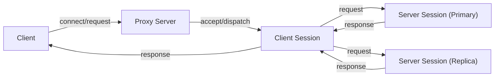

# Proxy Overview

## System Implementation Overview

This system is designed to seamlessly integrate a **primary write database** with a read-replica system, **Springtail**, through intelligent routing and robust session management. The goal is to offload read traffic while maintaining data consistency and transactional integrity.  At a high-level this involves splitting read and write accesses such that writes are performed at the Primary and reads are performed at the replicas.

The system is composed of the following components:
* **Client Session:** The connection from the client to the Proxy.
* **Server Session:** The connection from the Proxy to a database instance.  For every client session there exists a:
    * **Primary Session:** The connection from the Proxy to the primary database instance.
    * **Replica Session:** The connection from the Proxy to the replica (if a replica is available).

The diagram below shows the message path from a client through the proxy into the client-facing session and branching to primary and replica server sessions.

---

### Data Routing Engine (Read/Write Splitting)

The core function of the system is the read/write splitting, which determines the destination of each query:

1.  **Query Parsing:** The engine performs uses a Postgres parser to parse every incoming SQL query to determine the operation type (read vs. write) and to assess if the operation is supported by the Springtail read replicas.
2.  **Traffic Direction:**
    * **Writes (Primary Route):** All write operations (`INSERT`, `UPDATE`, `DELETE`) are directed exclusively to the **primary** database.
    * **Reads (Springtail Route):** All supported read operations (`SELECT`) are directed to the **Springtail** replica pool.
    * **Logging/Testing:** A mirrored path is implemented where, under specific testing conditions, all queries can be sent to both the primary and Springtail to **log and measure Springtail's performance and result consistency** against the primary.

---

### Session State and Load Management

The system maintains session level consistency across Primary and Replica connections and ensures load is balanced across replicas.

* **Session State:** To prevent errors, state-dependent operations like **prepared statements** and **SET search_path** are **mirrored**—meaning they are executed on both the primary and replica even if the primary is the source of truth for the resulting data change.
* **Replica Load Balancing:** The system incorporates a **round-robin/load balancing** component to distribute read requests evenly across the available **Springtail replicas**. This maintains high availability and efficiency.
    
If the Springtail system scales up, or scales down, the Proxy is aware of the changes in replica nodes.
* **Scale-up:** New sessions will be load-balanced across the new replica nodes.
* **Scale-down:** Existing sessions on the node being removed will fail-over to another replica if one exists, or will fail-over to the Primary (if no other replica exists).

---

### Transactional Integrity and Session Switching

The implementation must maintain the integrity of sessions and multi-step transactions, even when switching destinations.

Read/write splitting happens on a transaction level.  If a transaction starts on a replica and an UPDATE occurs, the Proxy will transition the transaction to the Primary.  The remainder of operations will occur on the Primary until that transaction is completed (committed or rolled-back). The system has the following requirements:

1.  **Transaction Tracking:** The system actively monitors the state of every **user session and ongoing transaction** started on Springtail.
2.  **Dynamic Switch-Over:** If a transaction being executed on a Springtail replica suddenly calls for a **write operation** or any unsupported operation, the system initiates an immediate **switch-over** to the primary database.
3.  **Session State Replay:** Crucially, before the primary accepts the switched transaction, the system must retrieve and **apply all current session-level settings** (e.g., timezone, transaction isolation level) that were active on the Springtail session to the new primary session. This ensures that the transaction completes with the exact same configuration it started with.

---

### Security and Access Layer

The implementation establishes secure and reliable client connections using:

* **Authentication:** The system enforces user identity verification using the standard PostgreSQL authentication mechanisms.  It first validates the user against the Primary database before allowing access to the replica.
* **Connection Termination:** Client traffic is received at a routing layer responsible for parsing and directing subsequent database operations.  All connections are (optionally) encrypted with TLS.
* **User Management:** All proxy users must be pre-registered with the Proxy (and must exist on the Primary).  The Proxy will periodically validate that the user has connection access to each replicated database.
