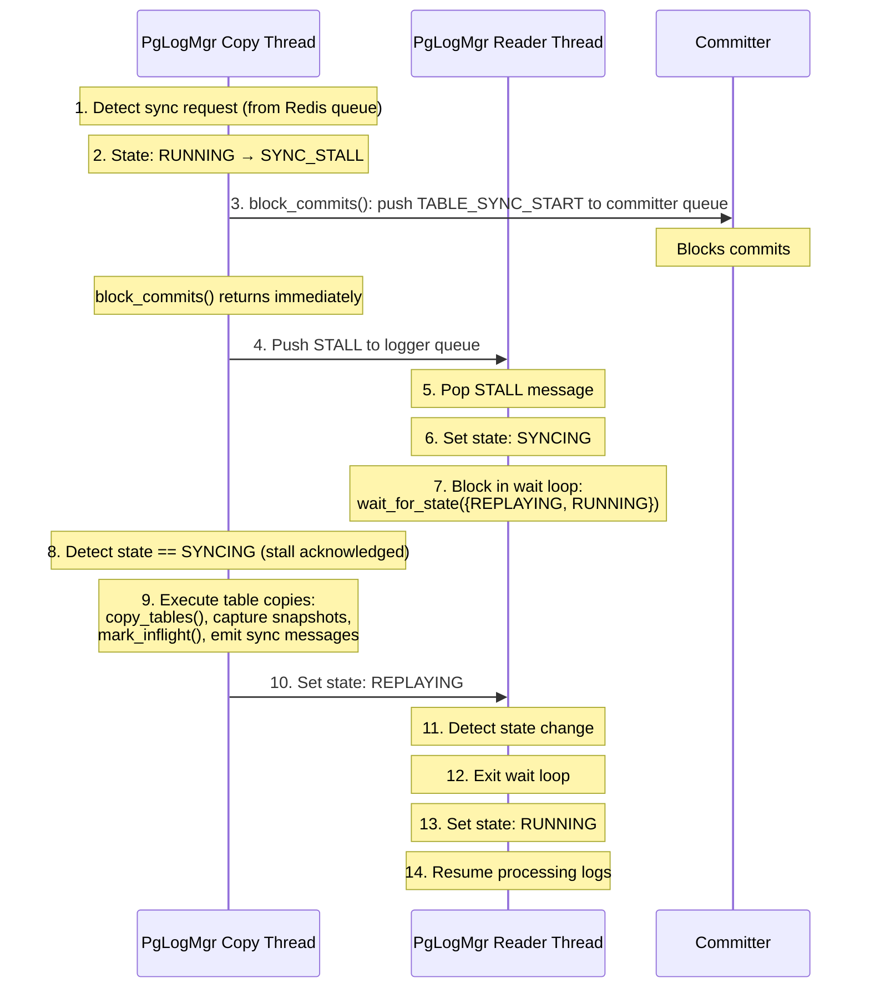
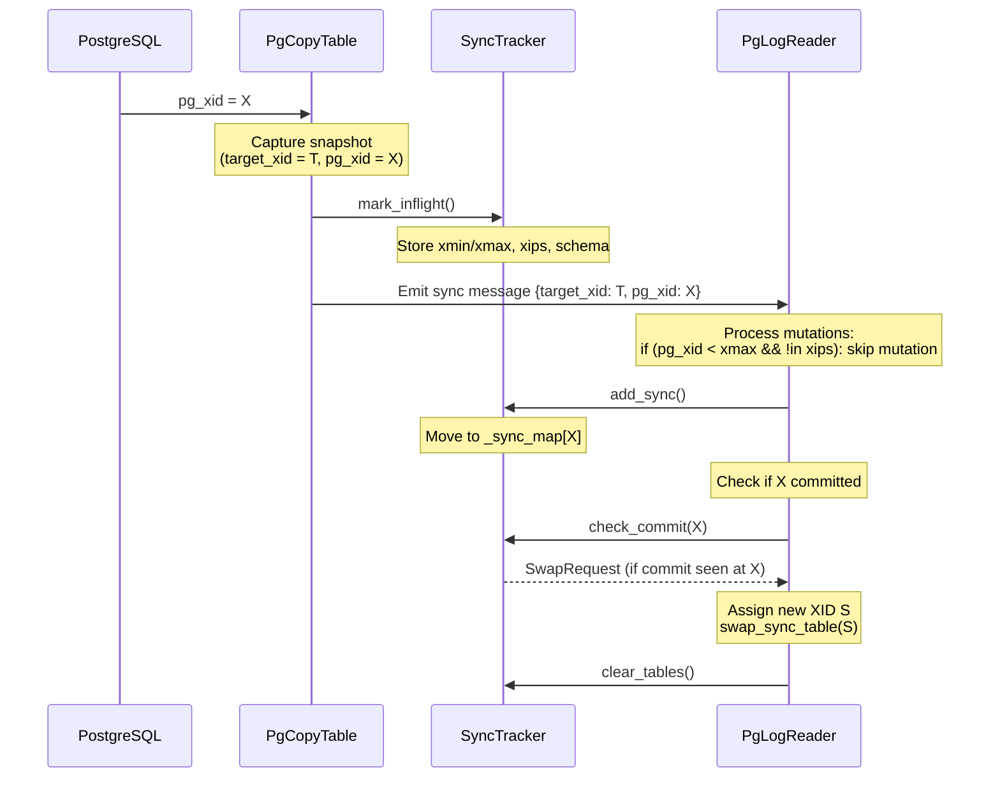
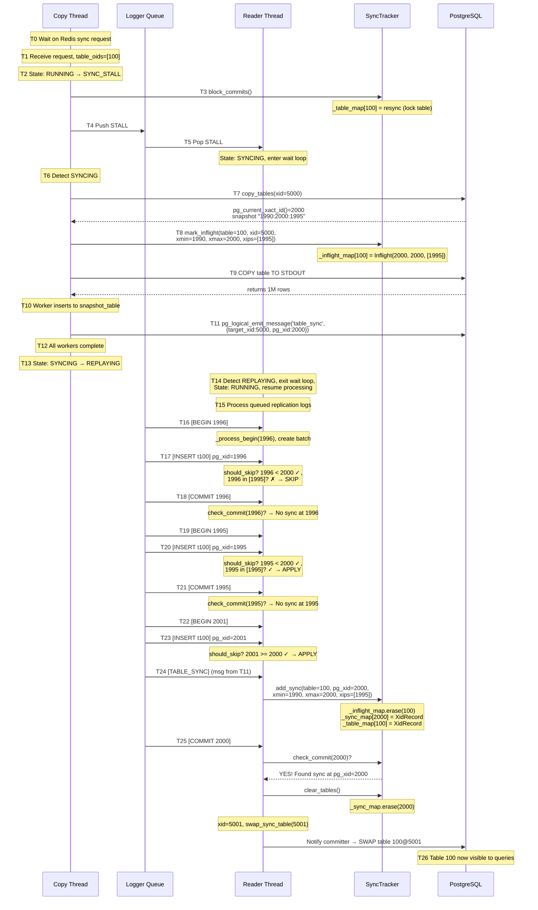

# Table Synchronization Architecture

## Overview

Springtail synchronizes tables from a primary PostgreSQL database using a sophisticated architecture that coordinates table copying with an ongoing three-stage replication pipeline (Log Writer → Log Reader → Committer). The PgCopyTable component operates independently to perform bulk table copies while the pipeline ensures consistency by tracking PostgreSQL transaction IDs (XIDs) and using snapshot-based visibility rules to determine which mutations should be applied during and after the copy.

This document describes the architecture for synchronizing tables into Springtail, with particular emphasis on:
- How the replication pipeline is stalled during table copies
- How PostgreSQL XIDs (pgxids) are tracked and used
- How snapshot-based visibility ensures correct synchronization points
- How log replay interacts with table synchronization

## Key Components

### PgLogMgr
**Location:** `src/pg_log_mgr/pg_log_mgr.{cc,hh}`

The orchestration hub for Springtail's replication pipeline. Manages a three-stage processing pipeline:

1. **Log Writer Thread** - Connects to PostgreSQL replication stream and writes to log files
2. **Log Reader Thread** - Reads log files and parses transactions (via PgLogReader)
3. **Committer** - Processes committed transactions and coordinates garbage collection

**Additional Coordination Thread:**
- **Copy Thread** - Coordinates table synchronization requests from Redis queue, using PgCopyTable to perform the actual copying while ensuring consistent snapshots through pipeline coordination

**State Machine:**
```
STATE_STARTUP        → Initial state upon startup
STATE_STARTUP_SYNC   → Full sync required after startup
STATE_RUNNING        → Normal operational state
STATE_SYNC_STALL     → Stalls pipeline during sync
STATE_SYNCING        → Actively syncing tables
STATE_REPLAYING      → Replaying logs after sync
STATE_STOPPED        → Shutdown state
```

**Key Responsibilities:**
- Manages state transitions during table synchronization
- Coordinates pipeline stalling via STALL messages in the logger queue
- Executes table copies via PgCopyTable
- Assigns Springtail XIDs to transactions

### PgCopyTable
**Location:** `src/pg_repl/pg_copy_table.{cc,hh}`

A separate component (not part of the main replication pipeline) that handles the actual table copying using PostgreSQL's binary COPY protocol. Invoked by PgLogMgr's Copy Thread and interacts with the pipeline through SyncTracker to ensure consistent snapshots.

**Key Features:**
- Multi-threaded: Uses 4 worker threads to copy tables in parallel
- Transaction isolation: Captures PostgreSQL snapshots (xmin/xmax/xips) at copy time
- Schema preservation: Extracts full table metadata including columns, types, indexes
- Sync coordination: Marks tables as "in-flight" via SyncTracker
- Replication messaging: Emits TABLE_SYNC messages via `pg_logical_emit_message()`

**Snapshot Capture:**
```cpp
// Captured for each table copy:
struct PgCopyResult {
    uint64_t target_xid;        // Springtail XID assigned to this copy
    uint32_t pg_xid;            // PostgreSQL XID at snapshot time
    uint32_t xmin, xmax;        // Snapshot boundaries
    uint32_t xmin_epoch, xmax_epoch;
    std::vector<uint32_t> xips; // In-progress transactions
    std::string pg_xids;        // Format: "xmin:xmax:xid,xid,..."
}
```

**Copy Process:**
1. Lock table in ACCESS SHARE MODE (prevents schema changes)
2. Capture snapshot via `pg_current_snapshot()`
3. Mark table as in-flight in SyncTracker
4. Execute `COPY table TO STDOUT WITH (FORMAT binary)`
5. Parse binary data and insert into snapshot table
6. Emit `pg_logical_emit_message()` with TABLE_SYNC_MSG

### SyncTracker
**Location:** `src/pg_log_mgr/sync_tracker.{cc,hh}`

Tracks table synchronization state and determines when mutations should be skipped during log replay. Acts as the bridge between PgCopyTable and the replication pipeline.

**Four Primary Data Structures:**

1. **`_resync_map`** - Tables where resync was issued but not yet picked up by copy thread
2. **`_resync_picked_map`** - Tables picked for resync at specific XID
3. **`_inflight_map`** - Tables whose COPY is currently in-flight (snapshot metadata stored here)
4. **`_table_map`** - Completed syncs indexed by table_id (persists for skip logic)
5. **`_sync_map`** - Completed syncs indexed by snapshot PG_XID (used for commit detection)

**State Transition Flow:**
```
issue_resync_and_wait()
  ↓ (Redis queue)
pick_table_for_sync()
  ↓ (copy thread begins)
mark_inflight() → _inflight_map
  ↓ (TABLE_SYNC_MSG arrives in log)
add_sync() → _sync_map + _table_map
  ↓ (check at commits)
check_commit() → SwapRequest when snapshot xid done
  ↓
clear_tables() → cleanup
```

**Snapshot-based Skip Logic:**

The core visibility algorithm in `Snapshot::should_skip()`:

```cpp
bool should_skip(uint32_t pg_xid) const {
    // Handle XID wraparound (32-bit XID wraps at 2^32)
    if (pg_xid < (1 << 26) && _xmax > (1 << 30)) {
        return false;  // pg_xid wrapped, is ahead of xmax
    }
    if (_xmax < (1 << 26) && pg_xid > (1 << 30)) {
        if (_inflight.contains(pg_xid)) {
            return false;  // Was in-flight, don't skip
        }
        return true;  // xmax wrapped ahead
    }

    // No wrapping case
    if (pg_xid >= _xmax) {
        return false;  // Started after snapshot
    }
    if (_inflight.contains(pg_xid)) {
        return false;  // Was in-flight during snapshot
    }
    return true;  // Committed before snapshot
}
```

**Key Principle:** Skip mutations from transactions that committed **before** the table snapshot was taken, since those rows are already in the copied table data.

### PgLogReader
**Location:** `src/pg_log_mgr/pg_log_reader.{cc,hh}`

Reads replication logs and applies mutations to the write cache. Coordinates with SyncTracker to skip mutations during table syncs.

**Skip Logic Integration:**

Every mutation (INSERT/UPDATE/DELETE) checks:
```cpp
auto sync_skip = SyncTracker::get_instance()->should_skip(_db, tid, pg_xid);
if (sync_skip.should_skip()) {
    return;  // Don't apply mutation
}
```

Lines where skip logic is applied:
- Line 229-235: INSERT/UPDATE/DELETE mutations
- Line 313-317: TRUNCATE operations
- Line 487-491: CREATE_TABLE/ALTER_RESYNC DDL
- Line 501-505: CREATE_INDEX/ALTER_TABLE/DROP_TABLE DDL

**Check-Sync-Commit Logic:**

When a `COPY_SYNC` message arrives (line 1193-1197) or during transaction commits (line 1351), `_check_sync_commit()` is called:

```cpp
void PgLogReader::_check_sync_commit(uint64_t db_id, int32_t pg_xid) {
    auto swap = SyncTracker::get_instance()->check_commit(db_id, pg_xid);
    if (swap != nullptr) {
        // Swap/commit is ready
        SyncTracker::get_instance()->clear_tables(swap);
        uint64_t xid = get_next_xid();

        // Update system tables and swap table into production
        for (auto &entry : swap->table_info()) {
            server->swap_sync_table(...);
        }

        // Notify committer
        _committer_queue->push(xid_msg);
    }
}
```

## Synchronization Flow

### Full Table Sync Process

#### 1. Sync Request Initiation

**Trigger Points:**
- Startup sync (STATE_STARTUP_SYNC)
- ALTER TABLE requiring resync
- Explicit resync via Redis queue
- Table validation changes (ALTER_RESYNC)

**Entry Point:** `PgLogMgr::_copy_thread()` blocks on Redis queue for sync requests

```cpp
// In pg_log_mgr.cc:_copy_thread()
while (!_shutdown) {
    auto request = _redis_sync_queue->pop_with_timeout(timeout);
    if (request) {
        table_oids.insert(request->table_oids.begin(),
                         request->table_oids.end());
    }
    // Batch multiple requests...
}
```

#### 2. Pipeline Stall Initiation

**Critical Section:** `PgLogMgr::_do_table_copies()`

```cpp
// Wait for pipeline to enter stall-able state
_internal_state.wait_and_set(
    {STATE_RUNNING, STATE_STARTUP_SYNC, STATE_REPLAYING},
    STATE_SYNC_STALL
);

// Block commits to prevent GC from removing data we're copying
SyncTracker::get_instance()->block_commits(_db_id, _committer_queue);

// Push STALL message to logger queue
_notify_xact_start_sync();  // Pushes PgLogQueueEntry::Type::STALL

// Wait for log reader to acknowledge stall
_internal_state.wait_for_state(STATE_SYNCING);
```

**Logger Queue STALL Message:**

The logger queue (`_logger_queue`) bridges the writer and reader threads. When a STALL message is pushed:

1. **Writer thread** continues writing replication data but queues it
2. **Reader thread** processes the STALL message in its main loop
3. Reader sets state to `STATE_SYNCING` and blocks
4. Writer receives acknowledgment and begins table copy

**Stall Handling in Log Reader:**

In the reader thread's processing loop, when a STALL entry is detected:

```cpp
if (log_entry->type == PgLogQueueEntry::Type::STALL) {
    assert(_internal_state.is(STATE_SYNC_STALL));
    _internal_state.set(STATE_SYNCING);  // Acknowledge stall

    // Wait for table sync to complete
    while (!_shutdown && !_internal_state.wait_for_state(
        {STATE_REPLAYING, STATE_RUNNING}, timeout)) {
        // Blocked until copy completes
    }

    _internal_state.set(STATE_RUNNING);  // Resume processing
}
```

#### 3. Table Copy Execution

**Assign Target XID:**
```cpp
auto xid = _pg_log_reader->get_next_xid();
LOG_INFO("Copying tables; target xid={}", xid);
```

This XID becomes the `target_xid` for all tables in this sync batch.

**Execute Copy:**
```cpp
std::vector<PgCopyResultPtr> res;
if (table_oids.empty()) {
    res = PgCopyTable::copy_db(_db_id, xid);
} else {
    res = PgCopyTable::copy_tables(_db_id, xid, table_oids);
}
```

**Worker Thread Process (PgCopyTable):**

Each of 4 worker threads:

1. **Pop table from queue**
2. **Connect to PostgreSQL**
3. **Lock table:** `LOCK TABLE schema.table IN ACCESS SHARE MODE`
4. **Capture snapshot:**
   ```sql
   SELECT pg_current_xact_id(), pg_current_snapshot()
   ```
   Returns: `(pg_xid, "xmin:xmax:xid,xid,...")`

5. **Mark in-flight in SyncTracker:**
   ```cpp
   SyncTracker::get_instance()->mark_inflight(
       db_id, table_oid, xid, snapshot_details, schema
   );
   ```

6. **Create snapshot table:**
   ```cpp
   auto table = TableMgr::get_instance()->get_snapshot_table(
       db_id, table_oid, xid.xid, schema, secondary_keys, ...
   );
   ```

7. **Execute COPY:**
   ```sql
   COPY schema.table TO STDOUT WITH (FORMAT binary, ENCODING 'UTF-8')
   -- Or for ordered copy:
   COPY (SELECT * FROM schema.table ORDER BY pk_col1, pk_col2)
       TO STDOUT WITH (FORMAT binary, ENCODING 'UTF-8')
   ```

8. **Parse binary data:**
   - Verify header: `"PGCOPY\n\377\r\n\0"`
   - Read tuples in PostgreSQL binary format
   - Insert into snapshot table

9. **Emit sync message:**
   ```cpp
   _send_sync_msg(result);

   // Generates:
   std::string query = fmt::format(
       "SELECT pg_logical_emit_message(false, '{}', '{}');",
       MSG_PREFIX_COPY_SYNC,
       R"({"target_xid":<xid>, "pg_xid":<pg_xid>})"
   );
   ```

This message enters the replication stream and will be processed by PgLogReader.

#### 4. Resume Pipeline

After all table copies complete:

```cpp
_internal_state.set(STATE_REPLAYING);
_internal_state.wait_for_state(STATE_RUNNING);
```

The log reader thread unblocks and resumes processing queued replication messages.

### How the System is Stalled

#### Stall Mechanism Architecture

The stall mechanism uses **inter-thread coordination** via state synchronizer and queue messages:

**Components:**
1. **StateSynchronizer** - Thread-safe state machine with atomic test-and-set
2. **Logger Queue** - Passes STALL message from writer to reader
3. **Committer Queue** - Receives TABLE_SYNC_START to block commits

**Detailed Stall Sequence:**



**Why This Works:**

- **Writer continues writing** - Replication stream isn't disconnected, just queued
- **Reader blocks safely** - No partial transaction application
- **Snapshots are consistent** - Captured while mutations are queued
- **No race conditions** - State transitions are atomic

#### Commit Blocking Details

When `SyncTracker::block_commits()` is called:

```cpp
void SyncTracker::block_commits(uint64_t db_id, CommitterQueuePtr committer_queue)
{
    _block_commits(db_id, committer_queue);
}

void SyncTracker::_block_commits(uint64_t db_id, CommitterQueuePtr committer_queue)
{
    auto msg = std::make_shared<committer::XidReady>(
        committer::XidReady::Type::TABLE_SYNC_START,
        db_id
    );
    committer_queue->push(msg);
}
```

The committer receives this message and:
1. Stops advancing the committed XID
2. Prevents garbage collection from removing data being copied
3. Resumes when table swap completes

### How PostgreSQL XIDs are Tracked and Used

#### XID Architecture Overview

Springtail maintains **two parallel XID spaces**:

1. **PostgreSQL XIDs (pg_xid)** - 32-bit transaction IDs from PostgreSQL
   - Subject to wraparound at 2^32
   - Used for snapshot visibility
   - Tracked with epoch for 64-bit uniqueness

2. **Springtail XIDs (xid)** - 64-bit global transaction IDs
   - Monotonically increasing
   - Never wrap around
   - Used for internal MVCC and garbage collection

**Mapping:** PgLogReader maintains `_xid_ts_tracker` (WalProgressTracker) that maps pg_xid → Springtail xid.

#### XID Assignment Flow

**During Normal Operation:**

```cpp
// In PgLogReader::_process_commit()
uint64_t xid = this->get_next_xid();  // Atomic fetch-and-add

// get_next_xid() implementation:
uint64_t get_next_xid() {
    return _next_xid.fetch_add(1, std::memory_order_relaxed);
}
```

Each committed PostgreSQL transaction receives a Springtail XID sequentially.

**During Table Copy:**

```cpp
// In PgLogMgr::_do_table_copies()
auto xid = _pg_log_reader->get_next_xid();
std::vector<PgCopyResultPtr> res = PgCopyTable::copy_db(_db_id, xid);
```

All tables in a sync batch share the **same Springtail XID** (`target_xid`), ensuring atomic visibility.

**Result Structure:**
```cpp
PgCopyResult {
    target_xid: <Springtail XID>     // Same for all tables in sync
    pg_xid: <PostgreSQL XID>         // Different per table (snapshot time)
    xmin: <32-bit>
    xmax: <32-bit>
    xips: [<32-bit>, ...]
}
```

#### XID Tracking During Sync

**Three Critical XIDs:**

1. **Target XID** - Springtail XID assigned before copy starts
   - Used for snapshot table creation
   - Used for system table updates
   - Used for swap operation

2. **Copy PG XID** - PostgreSQL XID when snapshot was taken
   - Captured via `pg_current_xact_id()`
   - Stored in `PgCopyResult::pg_xid`
   - Used in TABLE_SYNC message

3. **Snapshot XIDs** - xmin/xmax/xips defining visibility
   - Captured via `pg_current_snapshot()`
   - Used by `Snapshot::should_skip()` for mutations

**XID Flow Through System:**



#### Snapshot Visibility Rules

**PostgreSQL Snapshot Format:** `"xmin:xmax:xid1,xid2,..."`

Example: `"1000:1010:1002,1005,1008"`
- **xmin = 1000** - Oldest transaction still running
- **xmax = 1010** - One past highest completed XID
- **xips = [1002, 1005, 1008]** - Transactions in progress between xmin and xmax

**Visibility Decision for Mutation with pg_xid:**

```
if pg_xid >= xmax:
    # Transaction started after snapshot
    → Apply mutation (not in table copy)

elif pg_xid in xips:
    # Transaction was in-progress during snapshot
    → Apply mutation (outcome unknown)

else:
    # Transaction committed before snapshot
    → Skip mutation (already in table copy)
```

**Wraparound Handling:**

PostgreSQL XIDs wrap at 2^32. SyncTracker detects wraparound using threshold detection:

```cpp
// Detect if pg_xid wrapped ahead of xmax
if (pg_xid < (1 << 26) && _xmax > (1 << 30)) {
    return false;  // Assume pg_xid is ahead
}

// Detect if xmax wrapped ahead of pg_xid
if (_xmax < (1 << 26) && pg_xid > (1 << 30)) {
    if (_inflight.contains(pg_xid)) {
        return false;  // Was in-flight
    }
    return true;  // Before snapshot
}
```

Threshold of 2^26 (≈67 million) provides safe margin for detecting wraps.

### Table Swap and Commit

#### When Swap Occurs

The swap happens when **all in-progress transactions at snapshot time have committed**.

**Check Logic in SyncTracker::check_commit():**

```cpp
std::shared_ptr<SwapRequest> check_commit(uint64_t db_id, uint32_t pg_xid) {
    std::lock_guard lock(_mutex);

    // Look up sync records at this pg_xid
    auto sync_i = _sync_map[db_id].find(pg_xid);
    if (sync_i == _sync_map[db_id].end()) {
        return nullptr;  // No sync at this pg_xid
    }

    // Found a sync that completed at this pg_xid
    // Collect all tables from this sync
    std::vector<PgCopyResult::TableInfoPtr> table_info;
    for (auto &tid_entry : _table_map[db_id]) {
        if (tid_entry.second->pg_xid() == pg_xid) {
            table_info.insert(table_info.end(),
                            tid_entry.second->tids().begin(),
                            tid_entry.second->tids().end());
        }
    }

    return std::make_shared<SwapRequest>(
        XidReady::Type::TABLE_SYNC_SWAP, db_id, std::move(table_info)
    );
}
```

**Key Point:** When PgLogReader processes a commit for transaction X, it calls `check_commit(X)`. If X matches the `pg_xid` from a table sync snapshot, all transactions visible to that snapshot have now committed, so it's safe to swap.

#### Swap Process

**In PgLogReader::_check_sync_commit():**

```cpp
auto swap = SyncTracker::get_instance()->check_commit(db_id, pg_xid);
if (swap != nullptr) {
    // Clear from tracker
    SyncTracker::get_instance()->clear_tables(swap);

    // Assign new Springtail XID for swap operation
    uint64_t xid = get_next_xid();

    // For each table in the swap
    for (auto &entry : swap->table_info()) {
        _exists_cache->insert(db_id, entry->table_id, true);

        auto copy_info = entry->info;

        // Set XIDs for system table updates
        copy_info->mutable_namespace_req()->set_xid(xid);
        copy_info->mutable_namespace_req()->set_lsn(RESYNC_NAMESPACE_LSN);

        copy_info->mutable_table_req()->set_xid(xid);
        copy_info->mutable_table_req()->set_lsn(RESYNC_CREATE_LSN);

        // Perform atomic swap
        auto ddl_str = server->swap_sync_table(
            *namespace_req, *create_req, indexes_vec, *roots_req
        );

        // Queue for FDW notification
        RedisDDL::get_instance()->add_ddl(_db_id, xid, ddl_str);
    }

    // Notify committer
    auto xid_msg = std::make_shared<committer::XidReady>(
        swap->type(), swap->db(), _pg_log_timestamp,
        committer::XidReady::SwapMsg(xid, ddls, table_ids)
    );
    _committer_queue->push(xid_msg);
}
```

**System Table Updates:**

The `swap_sync_table()` operation:
1. Updates `springtail.tables` with new table root pointer
2. Updates `springtail.namespaces` if needed
3. Creates index entries in `springtail.indexes`
4. Invalidates client caches
5. Returns DDL statements for FDW propagation

**Atomicity:** The swap is atomic from the perspective of readers - they either see the old table or the new table, never partial state.

## Recovery and Error Handling

### Log Recovery on Startup

**Entry Point:** `PgLogMgr::startup()`

```cpp
if (do_init) {
    // Fresh initialization
    _startup_init();
    _wal_buffer_flag = true;
    _start_threads(do_init, lsn);
} else {
    // Recovery mode
    PgLogRecovery recovery(_db_id, _repl_log_path, _pg_log_reader,
                          _committer_queue, _index_requests_mgr);
    lsn = recovery.repair_logs();
    _start_threads(do_init, lsn);
    recovery.replay_logs();
    // Signal committer for index recovery
    _wal_buffer_flag = false;
}
```

#### Recovery Phases

**Phase 1: Repair Logs**

Scans replication logs to find last valid committed LSN:

```cpp
uint64_t PgLogRecovery::repair_logs() {
    // Scan log files backward
    // Find last committed transaction
    // Return LSN to resume from
}
```

**Phase 2: Replay Logs**

Three-stage replay process:

```cpp
void PgLogRecovery::replay_logs() {
    _revert_system_tables();     // Step 1: Revert to last committed XID
    _skip_committed();            // Step 2: Skip already-processed records
    _replay_active();             // Step 3: Replay incomplete transactions
    _replay_uncommitted();        // Step 4: Replay post-commit records
}
```

**Step 1 - Revert System Tables:**
- Query `xid_mgr` for last committed XID
- Revert `springtail.tables`, `springtail.namespaces`, etc. to that XID
- Ensures system catalog consistency

**Step 2 - Skip Committed:**
- Read log from last committed LSN
- Skip transactions already committed before crash
- Prevents duplicate application

**Step 3 - Replay Active:**
- Replay transactions that were in-progress at crash time
- Use snapshot visibility to skip invalid mutations

**Step 4 - Replay Uncommitted:**
- Process messages after last committed transaction
- Re-apply schema changes and mutations
- Rebuild write cache state

### Handling Copy Failures

**Worker Thread Error Handling:**

```cpp
// In PgCopyTable::_worker()
try {
    auto info = copy_table._copy_table(db_id, xid, request->table_oid, ...);
    copy_result->tids.push_back(info);

} catch (PgRetryError &e) {
    // Transient error - re-queue table
    copy_queue->push(request);

} catch (PgTableNotFoundError &e) {
    // Table dropped between discovery and copy
    LOG_ERROR("Table not found: oid {}", request->table_oid);
    // Continue with other tables

} catch (PgQueryError &e) {
    e.log_backtrace();
    CHECK(false);  // Fatal error
}
```

**Retry Logic:**
- Transient errors (connection loss, deadlock) → Re-queue table
- Table not found → Log error, mark as dropped, continue
- Other errors → Fatal, stop process

**Table Dropped During Sync:**

If a table is dropped after copy starts but before swap:

```cpp
// In PgLogReader::_check_sync_commit()
if (copy_info->is_table_dropped()) {
    // Generate DROP TABLE DDL instead of swap
    PgMsgDropTable drop_msg;
    drop_msg.oid = table_info.id();
    drop_msg.namespace_name = table_info.namespace_name();
    drop_msg.table = table_info.name();

    std::string ddl_stmt = server->drop_table(_db_id, XidLsn{xid}, drop_msg);
    ddls.emplace_back(ddl_stmt);
}
```

### XID Consistency Across Restarts

**XID Manager Persistence:**

The XidMgr tracks committed XIDs to persistent storage. On restart:

```cpp
// In PgLogReader constructor
_committed_xid = xid_mgr::XidMgrServer::get_instance()->get_committed_xid(db_id, 0);

// In PgLogMgr::startup()
uint64_t committed_xid = xid_mgr->get_committed_xid(_db_id, 0);
uint64_t next_xid = committed_xid + 2;  // Skip one for cleanup
_pg_log_reader->set_next_xid(next_xid);
```

**Duplicate Prevention:**

In commit processing:

```cpp
if (xid <= _committed_xid) {
    // Already processed - abort this batch
    _current_batch->abort(md.pg_commit_ts);
    _xid_ts_tracker->remove_pg_xid(_current_xact->xid);
} else {
    // New transaction - process normally
    _current_batch->commit(xid, md);
}
```

This prevents double-application of transactions during recovery.

## Message Flow Diagram

### Full Sync Lifecycle



## Performance Considerations

### Parallel Table Copying

- **4 worker threads** copy tables concurrently
- Each worker maintains independent PostgreSQL connection
- Results aggregated when all workers complete
- Thread-safe queue coordinates work distribution

### Binary COPY Protocol

- Efficient binary data transfer (vs. text COPY)
- No serialization overhead
- Direct field parsing into internal format
- Typical throughput: 100K+ rows/second per table

### Memory Management

- **Write cache batching:** 4MB extent size before flush
- **Snapshot tables:** Stored in mutable B-trees, not memory
- **Queue flow control:** Memory/file hybrid mode based on watermarks
- **Log archiving:** Old logs cleaned based on min active timestamp

### Stall Duration Minimization

The pipeline stall only occurs during:
1. Snapshot capture (~milliseconds)
2. Table metadata extraction (~seconds)

Bulk data copying happens **after** pipeline resumes, so replication lag is minimal.

## Configuration

### Key Constants

**From pg_log_mgr.cc:**
```cpp
LOG_ROLLOVER_SIZE_BYTES = 128 * 1024 * 1024  // 128MB log files
QUEUE_SIZE = 256 * 1024                      // Logger queue size
FSYNC_LOOP_INTERVAL_MS = 500                 // Log fsync frequency
```

**From pg_copy_table.cc:**
```cpp
NUM_COPY_WORKERS = 4                         // Worker thread count
MAX_BATCH_SIZE = 4 * 1024 * 1024            // 4MB extent batches
```

### Tuning Recommendations

1. **Increase worker threads** for databases with many small tables
2. **Decrease batch size** if memory pressure is high
3. **Increase queue size** if replication lag spikes during sync
4. **Enable log archiving** for regulatory compliance

---

## Summary

Springtail's table synchronization architecture achieves **zero downtime** and **consistency** through:

1. **Snapshot isolation** - Captures PostgreSQL snapshots to establish visibility boundaries
2. **Pipeline coordination** - Stalls log processing during snapshot capture only
3. **Skip-based replay** - Uses PostgreSQL XID visibility rules to skip redundant mutations
4. **Atomic swap** - Swaps tables when all in-flight transactions commit
5. **Recovery support** - Replays logs correctly after crashes
6. **Parallel execution** - Copies multiple tables concurrently for performance

The system ensures that:
- No mutations are lost during table sync
- No mutations are double-applied
- Table data is consistent with a specific point in the replication stream
- The system can recover from failures at any stage

This architecture enables Springtail to maintain real-time replication while performing bulk table synchronization operations.
