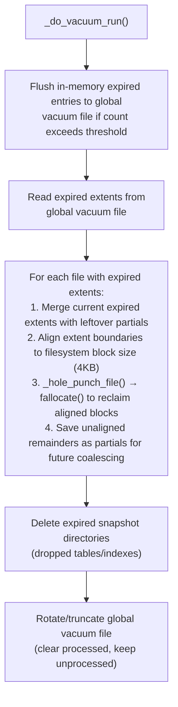

## Overview

  The **Vacuumer** is a storage management component in the Springtail database system that reclaims disk space from expired data. Springtail follows an **append-only storage model** —
  mutations (inserts, updates, deletes) create new extents rather than modifying existing data in place. Once a new extent is written, the previous extent becomes "expired" and eligible
  for vacuum.

  **XID-based safety** is central to the Vacuumer's operation: it only reclaims extents that have expired at an XID and all active transactions have moved past that XID point. The vacuum cutoff XID is computed
  as `min(min_fdw_xid, last_committed_xid, min_index_xid)`, ensuring that foreign data wrapper queries, uncommitted transactions, and ongoing index operations can still access the data
  they need.

  The Vacuumer operates as a singleton background service that:
  - Tracks expired extents (superseded by new extents) and dropped table snapshots
  - Performs **hole punching** via `fallocate()` to return unused disk blocks to the filesystem
  - Cleans up dropped table directories and old snapshot/roots files

  ---

## Key Components

  | Component | Description |
  |-----------|-------------|
  | **`Vacuumer`** | Main singleton class managing vacuum operations (`vacuumer.hh:97`) |
  | **`VacuumerUtils`** | Utility class for querying vacuum state without instantiating the full Vacuumer (`vacuumer.hh:42`) |
  | **`VacuumConfig`** | Namespace with configuration defaults: block size for hole punching (4KB), global vacuum file size threshold to trigger vacuum run (20KB), max expired extent entries held in memory before flushing to disk (10K) |
  | **`HoleInfo`** | Struct holding an expired extent's location: `{ offset, size }` (`vacuumer.hh:199-202`) |
  | **`ExtentMap`** | Tracks expired extents: `file → xid → vector<HoleInfo>` (`vacuumer.hh:240`) |
  | **`SnapshotMap`** | Tracks expired snapshots: `db_id → xid → list<paths>` (`vacuumer.hh:247`) |
  | **Global vacuum file** | Persistent log of pending vacuum work (`.global.vcm`) |
  | **Partial files** | Track unaligned leftover regions that couldn't be hole-punched (`_partials.vcm`) |

  ---

## Data Flow
```
  1. EXTENT EXPIRATION (triggered when append-only writes create new extents)
      StorageCache -> expire_extent() -> _extent_map[file][xid].push_back(offset, size)
  2. SNAPSHOT EXPIRATION (triggered by DROP TABLE/INDEX or schema changes)
      DDL operations -> expire_snapshot() -> _snapshot_map[db_id][xid].push_back(table_dir)
  3. COMMIT (on transaction commit)
      commit_expired_extents() -> writes entries to global vacuum file (.global.vcm)
  4. VACUUM RUN (background thread, every 1 second)
```


  ---

## Implementation Details

  **Extent Expiration Tracking** (`vacuumer.cc:370-396`)
  - `expire_extent()` is called via a callback registered with `StorageCache` (`vacuumer.cc:92-95`)
  - Each expired extent is recorded as a `HoleInfo` struct containing offset and size within the file, along with the XID at which it was superseded by a new extent
  - Entries are held in memory (`_extent_map`) until committed, then persisted to the global vacuum file
  - Memory threshold (`_max_entries_in_memory`, default 10K) triggers flush to disk if exceeded

  **Hole Punching Mechanics** (`vacuumer.cc:398-421`, `vacuumer.cc:916-998`)
  - Uses Linux `fallocate(fd, FALLOC_FL_PUNCH_HOLE | FALLOC_FL_KEEP_SIZE, offset, len)` to deallocate blocks
  - **Block alignment requirement**: Filesystem hole punching only works on block-aligned regions
    - `_align_up()` / `_align_down()` align to `_hole_punch_block_size` (default 4KB)
    - If an extent spans `[100, 5000]`, only `[4096, 4096]` can be punched; `[100, 4096]` and `[4096, 5000]` become partials
  - **Interval merging**: Uses `IntervalTree` to coalesce adjacent/overlapping expired regions before punching (`vacuumer.cc:928-972`)
  - **Partial handling**: Unaligned remainders are saved to per-file partial files (`_partials.vcm`) and merged in subsequent runs

  **XID-based Vacuum Safety** (`vacuumer.cc:430-439`)
  - **Cutoff XID** = `min(min_fdw_xid, last_committed_xid, min_index_xid)`
    - `min_fdw_xid`: Minimum XID in use by foreign data wrappers (active queries from remote)
    - `last_committed_xid`: Latest committed transaction (protects uncommitted data)
    - `min_index_xid`: Minimum XID for ongoing index builds/drops
  - Only extents with `XID < cutoff` are vacuumed, ensuring no active transaction can reference the data
  - Cutoff XIDs are persisted to Redis per-database for monitoring (`_save_last_seen_cutoff_xid`)

  **Persistence & Schema** (`vacuumer.cc:62-76`)
  - **Global vacuum schema**: `(file TEXT, offset UINT64, size UINT64, file_dropped BOOLEAN)`
    - `file_dropped=true` indicates a snapshot/directory deletion rather than hole punch
  - **Partial file schema**: `(offset UINT64, size UINT64)` — simpler, no file path needed (one file per source)
  - Atomic writes via runfiles: write to `.vcm.run`, then `rename()` to `.vcm`

  **Snapshot & Directory Cleanup** (`vacuumer.cc:1000-1055`)
  - Dropped tables/indexes are tracked in `_snapshot_map`
  - Uses `std::filesystem::remove_all()` to recursively delete table directories
  - Also cleans up associated partial files via `_cleanup_partial_files()`

  **Roots File Cleanup** (`vacuumer.cc:783-851`)
  - System tables maintain the roots in the files of the format (`roots.{xid}`)
  - Vacuum removes roots files with `XID < cutoff`, preserving the current symlinked version
  - Iterates all system tables defined in `sys_tbl::TABLE_IDS`

  **Recovery Protocol** (`vacuumer.cc:710-781`)
  Handles 4 crash states based on file presence:

  | State | Global File | Runfile | Partials Runfile | Recovery Action |
  |-------|-------------|---------|------------------|-----------------|
  | A | Empty | — | — | None |
  | B | Present | Present | — | Rename runfile → global, truncate to committed XID |
  | C | Present | — | Present | Remove partials runfile, truncate global to committed XID |
  | D | Present | — | — | Truncate global to committed XID |

  **Threading Model** (`vacuumer.cc:1118-1135`)
  - Background thread wakes every 1 second via `condition_variable::wait_until()`
  - All public methods acquire `_mutex` before accessing shared state
  - Graceful shutdown: `_internal_thread_shutdown()` signals CV, thread exits loop

  **Configuration** (loaded from `storage_config.vacuum_config` JSON)
  - `enabled`: Enable/disable vacuum service
  - `hole_punch_block_size`: Alignment for hole punching (default 4KB)
  - `global_file_size_threshold`: Minimum global file size to trigger vacuum run (default 20KB)
  - `max_entries_in_memory`: Memory threshold before forced flush (default 10K entries)
  - `vacuum_dir`: Base directory for vacuum metadata files
